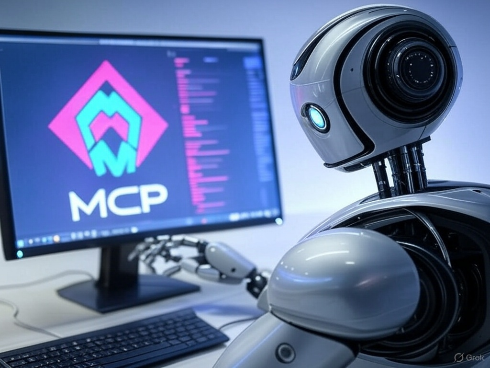

# MCP Browser Use

## What You Can Achieve With This MCP

This project aims to empower AI agents to perform web use, browser automation, scraping, and automation with Model Context Protocol (MCP) and Selenium.

> Our mission is to let AI agents complete any web task with minimal human supervision -- all based on natural language instructions.

## How to Use This MCP

